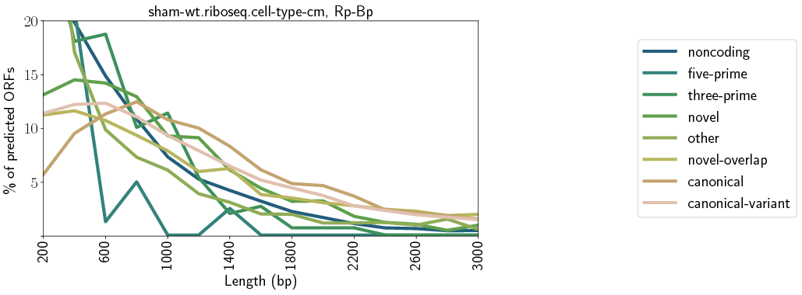

# QC and downstream analysis of the Rp-Bp results

Rp-Bp includes a number of additional scripts for quality control and downstream analysis.

* [Creating read length-specific profiles](#creating-read-length-specific-profiles)

* [Preprocessing analysis](#preprocessing-report)
    * [Counting and visualizing reads filtered at each step](#counting-and-visualizing-reads-filtered-at-each-step)
    * [Creating and visualizing read length distributions](#creating-and-visualizing-read-length-distributions)
    * [Visualizing read length metagene profiles](#visualizing-read-length-metagene-profiles)

* [Predictions analysis](#predictions-report)
    * [Counting and visualizing the predicted ORF types](#counting-and-visualizing-the-predicted-ORF-types)
    * [Visualising the predicted ORF types length distributions](#predicted-orf-types-length-distributions)
    * [Visualising the predicted ORF types metagene profiles](#predicted-orf-types-metagene-profiles)

---

<a id="creating-read-length-specific-profiles"></a>

## Creating read length-specific profiles

As described in the [usage instructions](usage-instructions.html), 
Rp-Bp writes the unsmoothed ORF profiles to a matrix market file. This profile 
merges reads of all lengths.

The `create-read-length-orf-profiles` script can be used to create profile files
which also include counts of individual read lengths.

```
create-read-length-orf-profiles <config> <sample or condition name> <out> [--is-condition] [--add-ids] [logging options] [processing options]
```

### Command line options

* `config`. A [YAML](http://www.yaml.org/start.html) configuration file.
* `sample or condition name`. The name of either one of the `riboseq_samples` or `riboseq_biological_replicates` from the config file
* `out`. The output (txt.gz) file, containing the read-length specific profiles. See below for details about the output format.
* [`--is-condition`]. If the `sample or condition name` is a condition, *i.e.* if it is a key from `riboseq_biological_replicates`, then this flag must be given.
* [`--add-ids`]. If this flag is present, then `orf_id` will be added to the final output (see below). 
* [`logging options`]. See [logging options](usage-instructions.html#logging-options).
* [`processing options`]. See [parallel processing options](usage-instructions.html#parallel-processing-options).

### Output format

Each line in the output file is a tuple containing the following values.

* `orf_num`. An identifier which maps to `orf_num` in the [list of ORFs](usage-instructions.html#creating-reference-genome-indices-output-files) for the reference, 
  `<genome_base_path>/transcript-index/<genome_name>.genomic-orfs.<orf_note>.bed.gz`.
* [`orf_id`]. Optionally, the `orf_id`.
* `orf_position`. The base-0 position or offset with respect to the spliced transcript (so *position % 3 == 0* implies the position is in-frame)
* `read_length`. The (trimmed) read length for this position.
* `read_count`. The sum of counts across all replicates for the condition (if `--is-condition` is given) or otherwise the single sample, after adjusting according to P-sites and removing multimappers.

**N.B. The output uses base-0 indexing, contrary to the unsmoothed ORF profiles, which are written using the matrix market format (base-1 indexing).**

<a id="preprocessing-report"></a>

## Preprocessing analysis

The `create-rpbp-preprocessing-report` script can be used to generate a latex document and several
plots which summarize the preprocessing and ORF profile construction. More details about each plot and how to call the scripts separately if desired are also given further below (use the links):

   * [Counting and visualizing reads filtered at each step](#counting-and-visualizing-reads-filtered-at-each-step)
   * [Creating and visualizing read length distributions](#creating-and-visualizing-read-length-distributions)
   * [Visualizing read length metagene profiles](#visualizing-read-length-metagene-profiles)

```
create-rpbp-preprocessing-report <config> <out> [--show-orf-periodicity] [--show-read-length-bfs] [--overwrite] [--min-visualization-count <min_visualization_count>] [--image-type <image_type>] [--note <note>] [-p/--num-cpus] [-c/--create-fastqc-reports] [--tmp <tmp>]
```

#### Command line options

* `config` A [YAML](http://www.yaml.org/start.html) configuration file.
* `out` A *directory* where the latex report will be created. If the directory does not exist, it will be created.
* [`--show-orf-periodicity`] If this flag is present, metagene periodicity
  plots will be created for ORFs of each type. (This is similar to Figure S2 in
  the supplement, although this will include all ORFs of the respective type,
  regardless of whether they are predicted as translated or not.) These plots
  can be quite time-consuming to create.
* [`--show-read-length-bfs`] If this flag is present, plots showing the Bayes
  factor for each possible P-site offset for each read length will be included.
* [`--overwrite`] By default, if an image file is already present, it will not
  be recreated. If this flag is given, any existing images will be overwritten.
* [`--min-visualization-count`] The minimum number of reads of a given length
  necessary to include the relevant plots for that read length in the report.
  Default: 500
* [`--image-type`] The extension for the image files. Matplotlib uses this to
  guess the type of the images. Default: eps. Other common types: png, pdf.
* [`--note`] An optional note to include in image file names. This takes
  precedence over the `note` specified in the config file.
* [`--num-cpus`] The number of samples to process at once.
* [`--create-fastqc-reports`] If this flag is present, the FastQC reports
  described below will be created. This can be rather time-consuming.
* [`--tmp`] A temp location for FastQC. It is not used by any of the other
  reporting scripts.

#### FastQC reports

If the `-c/--create-fastqc-reports` flag is given, then
[FastQC](http://www.bioinformatics.babraham.ac.uk/projects/fastqc/) reports
will be created for the following files for each sample.

* **Raw data** Files from `riboseq_samples` in the configuration file.

* **Trimmed and filtered reads** 
  `<riboseq_data>/without-adapters/<sample-name>[.<note>].fastq.gz`
  
* **Reads aligning to ribosomal sequences**
  `<riboseq_data>/with-rrna/<sample-name>[.<note>].fastq.gz`
  
* **Reads not aligning to ribosomal sequences**
  `<riboseq_data>/without-rrna/<sample-name>[.<note>].fastq.gz`
  
* **Reads aligned to the genome**
  `<riboseq_data>/without-rrna-mapping/<sample-name>[.<note>].bam`
  
* **Reads uniquely aligned to the genome**
  `<riboseq_data>/without-rrna-mapping/<sample-name>[.<note>]-unique.bam`


<a id="counting-and-visualizing-reads-filtered-at-each-step"></a>

### Counting and visualizing reads filtered at each step

The `get-all-read-filtering-counts` script counts reads filtered at each step of the preprocessing pipeline. This script requires `samtools` to be present in the `$PATH`.

#### Counting the reads

```
get-all-read-filtering-counts <config> <out> [--overwrite] [--num-cpus <num_cpus>]
```

##### Command line options

* `config` A [YAML](http://www.yaml.org/start.html) configuration file.
* `out` The output file, in csv.gz format. See below for details.
* [`--overwrite`] Unless this flag is given, then steps for which the output files already exist will be skipped.
* [`--num-cpus`] The script is parallelized at the sample level. If specified, this many samples will be processed at once.

##### Output format

The output is a "wide" data frame which contains one row for each sample. The
fields are as follows.

* `note` The name of the sample.
* `raw_data_count` The number of reads in the original fastq files.
* `without_adapters_count` The number of reads remaining after running 
  `flexbar` to remove adapters and low-quality reads.
* `without_rrna_count` The number of reads remaining after removing ribosomal
  and other reads with `bowtie2`.
* `genome_count` The number of reads with at least one genome alignment.
* `unique_count` The number of reads with exactly one genome alignment.
* `length_count` The number of uniquely mapping reads which also have a
  "periodic" read length, as determined by BPPS.

#### Visualizing the reads

The `visualize-read-filtering-counts` script visualizes the read counts from `get-all-read-filtering-counts`. An ipython notebook is also available, see below.

```
visualize-read-filtering-counts <read_counts> <out> [--without-rrna] [--title <title>] [--fontsize <fontsize>] [--legend-fontsize] <legend_fontsize>] [--ymax <ymax>] [--ystep <ystep>]
```

##### Command line options

* `read_counts` The output from `get-all-read-filtering-counts`.

* ` out` The output image file. The extension should be something recognized by
  matplotlib, such as png or pdf.

* [`--without-rrna`] If this flag is given, then the bar chart will not include
  reads filtered due to low quality or mapping to ribosomal sequences.

* [`--title`] A title placed at the top of the plot

* [`--fontsize`] The fontsize used for most of the text on the plot, including
  the tick labels (sample names and read counts), axis labels and title.

* [`--legend-fontsize`] The fontsize to use for the entries in the legend (the
  filtering steps).

* [`--ymax`] The maximum number of reads displayed on the y-axis. Typically,
  this value should be around 10% higher than the largest read count. However,
  some other value may be more appropriate if one of the samples has many more
  reads than the others.

* [`--ystep`] The frequency of tick marks on the y-axis.

##### Visualizing the reads (ipython notebook)

The `notebooks/preprocessing/create-read-filtering-bar-chart` notebook can be
used to visualize the read counts. Its functionality is essentially the same as
the `visualize-read-filtering-counts` script; however, the properties of the
plot, such as the exact location of the legend, are much easier to manipulate
in the notebook.

Additionally, the notebook will attempt to use the `riboseq_sample_name_map`
from the config file to find "pretty" names for the samples. In particular,
this should be a map from the sample name given in the `riboseq_samples` to a
string that will be used for the x-tick labels in the plot. If a sample name is
not present in the name map, it will be left unchanged.

**N.B.** This notebook needs to be "customized" as per user's requirements. See below for indications.

###### Control variables for the ipython notebook

In the third cell, the `config_files`, `alignment_counts_files`, `out_files` and
`without_rrna_files` dictionaries must be updated to include the relevant files.
The key in the dictionary should be the same for all of the new files.

In the fourth cell, the `data` variable should be changed to the key used in the
dictionaries. The other variables (`without-rrna`, *etc.*) have the same
interpretation as for the script.

In the sixth cell, visualization aspects such as the colors, legend location,
figure size, *etc.*, can be set using the respective matplot lib options.

##### Example visualization


<a id="creating-and-visualizing-read-length-distributions"></a>
 
### Creating and visualizing read length distributions

The `get-read-length-distribution` script (part of the [pybio](https://github.com/dieterich-lab/pybio-utils)
package, installed as a requirement to Rp-Bp) counts the number of reads of each length in a given BAM file. It can
be used to count the read length distribution for both all aligned reads and only uniquely-aligning reads.

**N.B.** The script handles multi-mappers to ensure they only contribute to the counts once.

#### Creating distributions

```
get-read-length-distribution <bam_1> [<bam_2> ...] -o/--out <length-counts.csv.gz> [-p/--num-cpus <num_cpus>]
```

##### Command line options

* `bam_i` The bam files which contain the aligned reads.

* `out` The output file, in csv.gz format, which contains the counts. See below for the column specifications.

* [`--num-cpus`] The number of CPUs to use; this many files will be processed at once.

##### Output format

The output is a "long" ("tidy") data frame with the following fields.

* `basename` The name of the bam file, excluding the *.bam* extension.
* `length` The read length.
* `count` The number of reads of that length in the indicated file.

#### Visualizing the distributions

The `plot-read-length-distribution` script creates a bar chart of the counts from `get-read-length-distribution`. An ipython notebook is also available, see below.

```
plot-read-length-distribution <distribution> <basename> <out> [--title <title>] [--min-read-length <min_read_length>] [--max-read-length <max_read_length>] [--ymax <ymax>] [--fontsize <fontsize>]
```

##### Command line options

* `distribution` The csv file created by `get-read-length-distribution`.
* `basename` The `basename` to visualize.
* `out` The output (image) file.
* [`--title`] The title of the plot.
* [`--{min, max}_read_length`] The minimum and maximum read lengths to include in the plot, inclusive. Defaults: [22, 35]
* [`--ymax`] The maximum value for the y-axis. Default: 1.5e6+1.
* [`--fontsize`] The size of the fonts for the title, axis labels and ticks.

##### Visualizing the distributions (ipython notebook)

The `notebooks/preprocessing/create-read-length-distribution-bar-chart` notebook
can be used to visualize the read counts. Its functionality is essentially the
same as `plot-read-length-distribution`; however, the properties of the plot,
such as the colors, are much easier to manipulate in the notebook.

Additionally, the notebook will attempt to use the `riboseq_sample_name_map`
from the config file to find "pretty" names for the samples. In particular,
this should be a map from the sample name given in the `riboseq_samples` to a
string that will be used for the x-tick labels in the plot. If a sample name is
not present in the name map, it will be left unchanged.

**N.B.** This notebook needs to be "customized" as per user's requirements. In particular, all of the relevant control variables in the third cell should point to the
appropriate files.

#### Example visualization


<a id="visualizing-read-length-metagene-profiles"></a>

### Visualizing read length metagene profiles

As described in the [usage instructions](usage-instructions.html#running-pipelines-output-1),
metagene profiles for each read lengths are created as a part of the pipeline.
These can be visualized with the `create-read-length-metagene-profile-plot`
script. In particular, it shows the reads aligned around the annotated
translation initiation (TIS) and termination sites. There is currently no ipython notebook to create these plots.

```
create-read-length-metagene-profile-plot <metagene_profile> <length> <out> [--title <title>] [--xlabel-start <xlabel_start>] [--xlabel-end <xlabel_end>] [--ylabel <ylabel>] [--step <step>] [--font-size <fontsize>] [--start-upstream <start_upstream>] [--start-downstream <start_downstream>] [--end-upstream <end_upstream>] [--end-downstream <end_downstream>] [--use-entire-profile]
```

#### Command line options

* `metagene_profile` The metagene profile file (`<riboseq_data>/metagene-profiles/<sample-name>[.<note>]-unique.metagene-profile.csv.gz`)

* `length` The length to visualize.

* `out` The output (image) file.

* [`--title`] A title for the plot.

* [`--xlabel-{start,end}`] Messages to include beneath the x-axis around the
  initiation and termination sites, respectively. Defaults: "Position of P-site
  relative to start (nt)\\nRed: TIS. Green: TIS -12", "Position of P-site
  relative to stop (nt)\\nBlue: Translation termination"

* [`--ylabel`] The label for the y-axis. Default: "Read count (starting at bp x)"

* [`--step`] The step size for the x-axis. Default: 10.

* [`--font-size`] The font size for everything in the plot. Default: 15.

* [`--{start,end}-{up,down}stream`] The position (in bp) to start and end the
  visualization around the translation initiation (`start`) and termination
  (`end`) sites. **N.B.** The `upstream` options must be negative, and the
  `downstream` options must be position. Defaults: [-50, 21] (for both).

* [`--use-entire-profile`] If this option is given, then the entire profile
  in the file will be used, rather than the positions given by the other
  options.

#### Example visualization


<a id="predictions-report"></a>

## Predictions analysis

The `create-rpbp-predictions-report` script can be used to generate a latex document and several
plots which summarize the predictions made by Rp-Bp. More details about each plot and how to call the scripts separately if desired are also given further below (use the links):

   * [Counting and visualizing the predicted ORF types](#counting-and-visualizing-the-predicted-ORF-types)
   * [Visualising the predicted ORF types length distributions](#predicted-orf-types-length-distributions)
   * [Visualising the predicted ORF types metagene profiles](#predicted-orf-types-metagene-profiles)

```
create-rpbp-predictions-report <config> <out> [--show-unfiltered-orfs] [--show-orf-periodicity] [--show-chisq] [--uniprot <uniprot>] [--uniprot-label <uniprot_label>] [--image-type <image_type>] [--note <note>] [--overwrite] [--num-cpus <num_cpus>]
```

#### Command line options

* `config` A yaml config file

* `out` A *directory* where the latex report will be created. If the directory
  does not exist, it will be created.

* [`--show-unfiltered-orfs`] By default, only the "filtered" ORF predictions
  (longest ORF at each stop codon and highest Bayes factor among overlapping
  ORFs; see "Final prediction set" in the paper). If this flag is given, then
  additional plots will be included showing the relevant statistics for all
  ORFs predicted as translated. Typically, the `canonical_truncated` type
  dominates these plots, so they are often not informative.

* [`--show-orf-periodicity`] If this flag is present, metagene periodicity
  plots will be created for ORFs predicted as translated of each type. (This is
  similar to Figure S2 in the supplement.) These plots can be somewhat
  time-consuming to create, especially if the `--show-unfiltered-orfs` flag is
  given.

* [`--show-chisq`] As described in the [usage instructions](usage-instructions.html#predicting-translated-open-reading-frames),
  the Rp-chi pipeline also can also make predictions using a simple chi square test. This is
  very similar to the ORFscore [Bazzini _et al_., _The EMBO Journal_, 2014]. If
  this flag is given, then plots will be created for the chi square predictions (filtered and unfiltered, if the
  `--show-unfiltered-orfs` flag is given). **N.B** The predictions output files must be available, *i.e.* one must have first used the `chi_square_only` flag when running Rp-Bp; by default they will not be available.

* [`--uniprot`] Optionally, the ORF type length distributions can include the
  distribution of Uniprot (or other "reference") transcript sequences. If given,
  then the KL-divergence will be calculated between the length distributions.
  This is similar to Figure S3 in the paper, though the ORFs will be split by
  type.

    This should be a tab-delimited file which includes at least the fields
    "Status" and "Length". For the paper, we created this file on the 
    [UniProtKB](www.uniprot.org/uniprot) by filtering on the relevant organism and
    using an identity of "90%" for the protein clusters (under the "UniRef"
    heading on the left panel on the UniProtKB results page).

* [`--uniprot-label`] The label to use for the `--uniprot` sequence lengths, if
  they are given.

* [`--image-type`] The extension to use for the image files. This must be
  something matplotlib can interpret. The figures do not include large scatter
  plots, etc., so the default is probably fine. Default: pdf. Other common
  types: eps, png.

* [`--note`] An optional note to include in image file names. This takes
  precedence over the `note` specified in the config file.

* [`--overwrite`] By default, if an image file is already present, it will not
  be recreated. If this flag is given, any existing images will be overwritten.

* [`--num-cpus`] The number of samples to process at once.


<a id="counting-and-visualizing-the-predicted-ORF-types"></a>

### Counting and visualizing the predicted ORF types

The `create-orf-types-bar-chart` and `create-orf-types-pie-chart` scripts can be
used to show the count of each type of ORF in a given BED file (which includes
the `orf_type` field). For example, this can be used for both the filtered and
unfiltered prediction files.

Both scripts show the number of ORFs of each type on both strands. Typically, there should not be a strong bias between the strands.

*N.B.* Currently, only the `bar-chart` script is used by default when calling `create-rpbp-predictions-report`, so if desired, the `pie-chart` script can be called separately. An ipython notebook is also available for both the bar and the pie chart.

```
create-orf-types-bar-chart <orfs> <out> [--title <title>] [--use-groups] [--legend-fontsize <legend_fontsize>] [--fontsize <fontsize>] [--ymax <ymax>]

create-orf-types-pie-chart <orfs> <out> [--title <title>] [--use-groups] 
```

#### Command line options

The shared command line options are the same for both scripts.

* `orfs` The bed file containing the ORFs, presumably located in `<riboseq_data>/orf-predictions/`

* `out` The image file.

* [`--title`] A title for the plot.

* [`--use-groups`] If this flag is present, then ORF types will be combined
  as described in the supplement of the paper. In particular, the following
  groups are used:

    * Canonical: canonical
    * Canonical variant: canonical_extended, canonical_truncated
    * uORF: five_prime
    * dORF: three_prime
    * ncRNA: noncoding
    * Other: five_prime_overlap, suspect_overlap, three_prime_overlap, within
    * de novo only: novel
    * de novo overlap: all other "novel" types

* [`--{legend-}fontsize`] The fontsize to use in the respective places in the
  bar chart. Default: 15, 20.

* [`--ymax`] The maximum value for the y-axis in the bar chart. Default:1e4.

#### Counting and visualizing the predicted ORF types (ipython notebooks)

The `notebooks/rpbp-predictions/create-orf-type-{bar,pie}-chart.ipynb` notebooks
can be used to create the same plots. The relevant variables in the third cell
should be updated. The notebooks allow easier control over the colors, *etc.*

### Example visualizations


<a id="predicted-orf-types-length-distributions"></a>

### Visualising the predicted ORF types length distributions

The `create-orf-length-distribution-line-graph` script can be
used to show the length distributions of the various types of ORFs in a given BED file (which includes
the `orf_type` field). Optionally, it can also include the length distribution of ORFs downloaded from uniprot. 
If uniprot ORFs are given, then the KL-divergence between the type distributions and the uniprot ORFs is calculated. An ipython notebook is also available.
        
```
create-orf-length-distribution-line-graph <orfs> <out> [--title <title>] [--use-groups] [--uniprot] [--uniprot-label]

```

#### Command line options

* `orfs` The bed file containing the ORFs, presumably located in `<riboseq_data>/orf-predictions/`

* `out` The image file.

* [`--title`] A title for the plot.

* [`--use-groups`] If this flag is present, then ORF types will be combined
  as described in the supplement of the paper. In particular, the following
  groups are used:

    * Canonical: canonical
    * Canonical variant: canonical_extended, canonical_truncated
    * uORF: five_prime
    * dORF: three_prime
    * ncRNA: noncoding
    * Other: five_prime_overlap, suspect_overlap, three_prime_overlap, within
    * de novo only: novel
    * de novo overlap: all other "novel" types

* [`--uniprot`] The uniprot ORF lengths, if available.

* [`--uniprot-label`] The label to use for the uniprot ORFs.

### Counting and visualizing the predicted ORF types length distributions (ipython notebooks)

The `notebooks/rpbp-predictions/create-orf-length-distribution-plot.ipynb` notebook
can be used to create the same plots. The relevant variables in the fifth cell (and sixth if using `--uniprot`)
should be updated. The notebooks allow easier control over the rendering of the plots.

### Example visualizations



<a id="predicted-orf-types-metagene-profiles"></a>

### Visualising the predicted ORF types metagene profiles

The `visualise-orf-length-metagene-profiles` script can be
used to show the metagene profiles for each ORF type present in a given BED file (the resulting figure is similar to Figure S2 in the supplement of the paper).
It visualizes the mean and variance of normalized profiles in the first 21-bp, last 21-bp, and across all other 21-bp windows.
        
```
visualise-orf-length-metagene-profiles <orfs> <profiles> <out> [--min-profile] [--max-orfs] [--title <title>] [--image-type]

```

#### Command line options

* `orfs` The bed file containing the ORFs, presumably located in `<riboseq_data>/orf-predictions/`

* `profiles` The (mtx) file containing the ORF profiles, presumably located in `<riboseq_data>/orf-profiles/`

* `out` The image file.

* [`--min-profile`] The minimum value of the sum over the profile to include. Default: 5.

* [`--max-orfs`] At most this many ORFs of each type will be used to create the figures. They will be sampled randomly from among those which meet the min-profile constraint. Default: 10000.

* [`--title`] A title for the plot.

* [`--image-type`] The type of image files to create. Default: eps.

### Counting and visualizing the predicted ORF types metagene profiles (ipython notebooks)

The `notebooks/rpbp-predictions/create-orf-type-metagene-profiles.ipynb` notebook
can be used to create the same plots. 

**N.B.** This notebook needs to be "customized" as per user's requirements.
