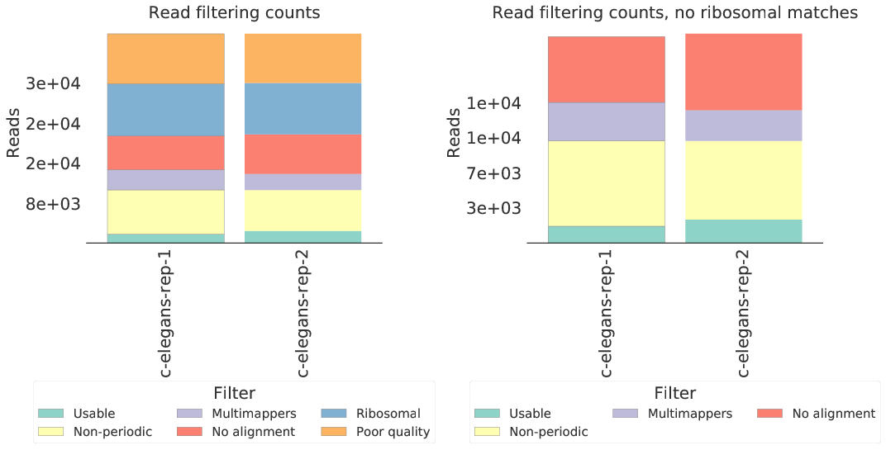
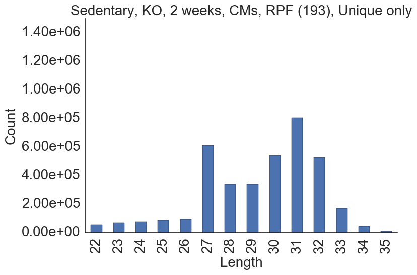
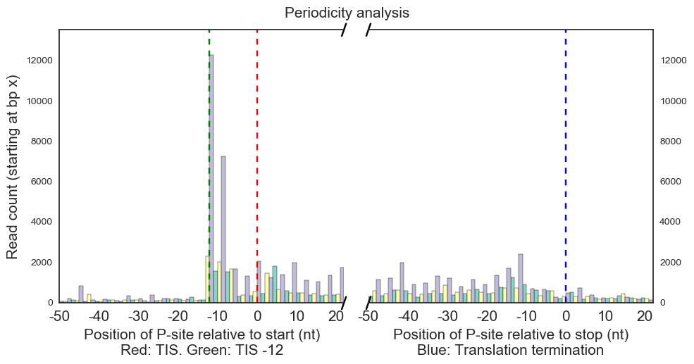
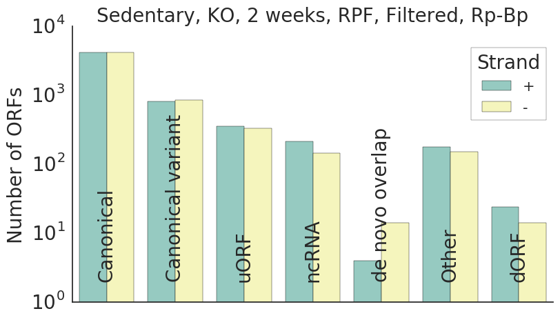
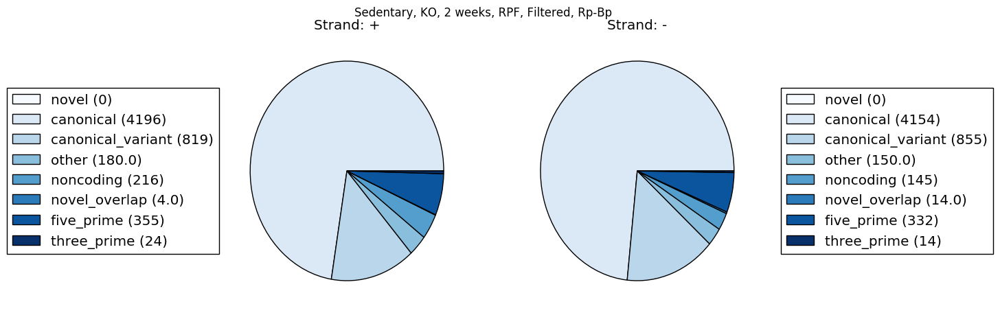

# QC and downstream analysis of the Rp-Bp results

Rp-Bp includes a number of additional scripts for quality control and downstream
analysis.

* [Creating read length-specific profiles](#creating-read-length-specific-profiles)

* [Preprocessing analysis](#preprocessing-report)
    * [Counting and visualizing reads filtered at each step](#counting-and-visualizing-reads-filtered-at-each-step)
    * [Creating and visualizing read length distributions](#creating-and-visualizing-read-length-distributions)
    * [Visualizing read length metagene profiles](#visualizing-read-length-metagene-profiles)

* [Predictions analysis](#predictions-report)
    * [Counting and visualizing the predicted ORF types](#counting-and-visualizing-the-predicted-ORF-types)

## Creating read length-specific profiles

As described in the [usage instructions](usage-instructions.md#output-files-1), 
Rp-Bp writes the unsmoothed ORF profiles to a matrix market file. This profile 
merges reads of all lengths.

The `create-read-length-orf-profiles` script can be used to create profile files
which also include counts of individual read lengths.

```
create-read-length-orf-profiles <config> <sample or condition name> <out> [--is-condition]
```

### Command line options

* `config`. A yaml config file

* `sample or condition name`. The name of either one of the `riboseq_samples` or
  `riboseq_biological_replicates` from the config file

* `out`. The output (txt.gz) file, containing the read-length specific profiles.
  The format is a sparse coordinate format inspired by the [matrix market 
  format](http://math.nist.gov/MatrixMarket/formats.html). See below for 
  details about the output format.

* [`--is-condition`]. If the `sample or condition name` is a condition, that is,
  if it is a key from `riboseq_biological_replicates`, then this flag must be
  given.

Additionally, the command can be given [logging](usage-instructions.md#logging-options)
and [slurm](usage-instructions.md#parallel-processing-options) options.

### Output format

Each line in the output file is a tuple containing the following values.

* `read_length`. The (trimmed) read lengths for this position.

* `orf_num`. An identifier which maps to `orf_num` in the [(static) list of 
  ORFs](usage-instructions.md#output-files) for the reference, 
  `<genome_base_path>/transcript-index/<genome_name>.genomic-orfs.<orf_note>.bed.gz`.

* `orf_position`. The base-0 position with respect to the spliced transcript 
  (so `position % 3 == 0` implies the position is in-frame)

* `read_count`. The sum of counts across all replicates for the condition (if
  `--is-condition` is given) or the single sample (otherwise) after adjusting
    according to P-sites and removing multimappers.

## Preprocessing report

The `create-rpbp-preprocessing-report` script can be used to create several
plots which summarize the preprocessing and ORF profile construction. The script
creates all of the following plots and generates a latex document including all
of them.

* [Counting and visualizing reads filtered at each step](#counting-and-visualizing-reads-filtered-at-each-step)
* [Creating and visualizing read length distributions](#creating-and-visualizing-read-length-distributions)
* [Visualizing read length metagene profiles](#visualizing-read-length-metagene-profiles)

Optionally, the script can also call FastQC. See more details below.


```
create-rpbp-preprocessing-report <config> <out> [--show-orf-periodicity] [--show-read-length-bfs] [--overwrite] [--min-visualization-count <min_visualization_count>] [--image-type <image_type>] [--note <note>] [-p/--num-cpus] [-c/--create-fastqc-reports] [--tmp <tmp>]
```

### Command line options

* `config`. A yaml config file

* `out`. A *directory* where the latex report will be created. If the directory
  does not exist, it will be created.

* [`--show-orf-periodicity`]. If this flag is present, metagene periodicity
  plots will be created for ORFs of each type. (This is similar to Figure S2 in
  the supplement, although this will include all ORFs of the respective type,
  regardless of whether they are predicted as translated or not.) These plots
  can be quite time-consuming to create.

* [`--show-read-length-bfs`]. If this flag is present, plots showing the Bayes
  factor for each possible P-site offset for each read length will be included.

* [`--overwrite`]. By default, if an image file is already present, it will not
  be recreated. If this flag is given, any existing images will be overwritten.

* [`--min-visualization-count`]. The minimum number of reads of a given length
  necessary to include the relevant plots for that read length in the report.
  Default: 500

* [`--image-type`]. The extension for the image files. Matplotlib uses this to
  guess the type of the images. Default: eps. Other common types: png, pdf.

* [`--note`]. An optional note to include in image file names. This takes
  precedence over the `note` specified in the config file.

* [`--num-cpus`]. The number of samples to process at once.

* [`--create-fastqc-reports`]. If this flag is present, the FastQC reports
  described below will be created. This can be rather time-consuming.

* [`--tmp`]. A temp location for FastQC. It is not used by any of the other
  reporting scripts.

### FastQC reports

If the `-c/--create-fastqc-reports` flag is given, then
[FastQC](http://www.bioinformatics.babraham.ac.uk/projects/fastqc/) reports
will be created for the following files for each sample.

* Raw data. Files from `riboseq_samples` in the config file.

* Trimmed and filtered reads. 
  `<riboseq_data>/without-adapters/<sample-name>[.<note>].fastq.gz`
  
* Reads aligning to ribosomal sequences. 
  `<riboseq_data>/with-rrna/<sample-name>[.<note>].fastq.gz`
  
* Reads not aligning to ribosomal sequences. 
  `<riboseq_data>/without-rrna/<sample-name>[.<note>].fastq.gz`
  
* Reads aligned to the genome. 
  `<riboseq_data>/without-rrna-mapping/<sample-name>[.<note>].bam`
  
* Reads uniquely aligned to the genome.
  `<riboseq_data>/without-rrna-mapping/<sample-name>[.<note>]-unique.bam`

## Counting and visualizing reads filtered at each step

### Counting

The `get-all-read-filtering-counts` script counts reads filtered at each step
of the preprocessing pipeline.

This script requires `samtools` to be present in `$PATH`.

```
get-all-read-filtering-counts <config> <out> [--num-cpus <num_cpus>]
```

#### Command line options

* `config`. A yaml config file

* `out`. The output file, in csv.gz format. See below for details.

* [`--num-cpus`]. The script is parallelized at the sample level. If specified,
  this many samples will be processed at once.

#### Output format

The output is a "wide" data frame which contains one row for each sample. The
fields are as follows.

* `note`. The name of the sample.
* `raw_data_count`. The number of reads in the original fastq files.
* `without_adapters_count`. The number of reads remaining after running 
  `flexbar` to remove adapters and low-quality reads.
* `without_rrna_count`. The number of reads remaining after removing ribosomal
  and other reads with `bowtie2`.
* `genome_count`. The number of reads with at least one genome alignment.
* `unique_count`. The number of reads with exactly one genome alignment.
* `length_count`. The number of uniquely mapping reads which also have a
  "periodic" read length, as determined by BPPS.

### Visualizing (script)

The `visualize-read-filtering-counts` script visualizes the read counts from
`get-all-read-filtering-counts`.

```
visualize-read-filtering-counts <read_counts> <out> [--without-rrna] [--title <title>] [--fontsize <fontsize>] [--legend-fontsize] <legend_fontsize>] [--ymax <ymax>] [--ystep <ystep>]
```

#### Command line options

* `read_counts`. The output from `get-all-read-filtering-counts`

* ` out`. The output image file. The extension should be something recognized by
  matplotlib, such as `png` or `pdf`.

* [`--without-rrna`]. If this flag is given, then the bar chart will not include
  reads filtered due to low quality or mapping to ribosomal sequences.

* [`--title`]. A title placed at the top of the plot

* [`--fontsize`]. The fontsize used for most of the text on the plot, including
  the tick labels (sample names and read counts), axis labels and title.

* [`--legend-fontsize`]. The fontsize to use for the entries in the legend (the
  filtering steps).

* [`--ymax`]. The maximum number of reads displayed on the y-axis. Typically,
  this value should be around 10% higher than the largest read count. However,
  some other value may be more appropriate if one of the samples has many more
  reads than the others.

* [`--ystep`]. The frequency of tick marks on the y-axis.

### Visualizing (ipython notebook)

The `notebooks/preprocessing/create-read-filtering-bar-chart` notebook can be
used to visualize the read counts. It functionality is essentially the same as
the `visualize-read-filtering-counts` script; however, the properties of the
plot, such as the exact location of the legend, are much easier to manipulate
in the notebook.

Additionally, the notebook will attempt to use the `riboseq_sample_name_map`
from the config file to find "pretty" names for the samples. In particular,
this should be a map from the sample name given in the `riboseq_samples` to a
string that will be used for the x-tick labels in the plot. If a sample name is
not present in the name map, it will be left unchanged.

#### Control variables

In the third cell, the `config_files`, `alignment_counts_files`, `out_files` and
`without_rrna_files` dictionaries must be updated to include the relevant files.
The key in the dictionary should be the same for all of the new files.

In the fourth cell, the `data` variable should be changed to the key used in the
dictionaries. The other variables (`without-rrna`, etc.) have the same
interpretation as for the script.

In the sixth cell, visualization aspects such as the colors, legend location,
figure size, etc., can be set using the respective matplot lib options.

### Example visualization



## Creating and visualizing read length distributions

### Creating distributions

The `get-read-length-distribution` script (part of the [misc](https://bitbucket.org/bmmalone/misc)
package) counts the number of reads of each length in a given bam file. It can
be used to count the read length distribution for both all aligned reads and
only uniquely-aligning reads.

**N.B.** The script handles multi-mappers to ensure they only contribute to the
counts once.

```
get-read-length-distribution <bam_1> [<bam_2> ...] -o/--out <length-counts.csv.gz> [-p/--num-cpus <num_cpus>]
```

#### Command line options

* `bam_i`. The bam files which contain the aligned reads.

* `out`. The output file, in csv.gz format, which contains the counts. See
  below for the column specifications.

* [`--num-cpus`]. The number of CPUs to use; this many files will be processed
  at once.

#### Output format

The output is a "long" ("tidy") data frame with the following fields.

* `basename`. The name of the bam file, excluding the "`.bam`" extension.
* `length`. The read length.
* `count`. The number of reads of that length in the indicated file.

### Visualizing the distributions (script)

The `plot-read-length-distribution` script creates a bar chart of the counts
from `get-read-length-distribution`.

```
plot-read-length-distribution <distribution> <basename> <out> [--title <title>] [--min-read-length <min_read_length>] [--max-read-length <max_read_length>] [--ymax <ymax>] [--fontsize <fontsize>]
```

### Command line options

* `distribution`. The csv file created by `get-read-length-distribution`.
* `basename`. The `basename` to visualize.
* `out`. The output (image) file

* [`--title`]. The title of the plot.
* [`--{min, max}_read_length`]. The minimum and maximum read lengths to include in
  the plot, inclusive. Defaults: [22, 35]
* [`--ymax`]. The maximum value for the y-axis. Default: 1.5e6+1
* [`--fontsize`]. The size of the fonts for the title, axis labels and ticks

### Visualizing the distributions (ipython notebook)

The `notebooks/preprocessing/create-read-length-distribution-bar-chart` notebook
can be used to visualize the read counts. Its functionality is essentially the
same as `plot-read-length-distribution`; however, the properties of the plot,
such as the colors, are much easier to manipulate in the notebook.

Additionally, the notebook will attempt to use the `riboseq_sample_name_map`
from the config file to find "pretty" names for the samples. In particular,
this should be a map from the sample name given in the `riboseq_samples` to a
string that will be used for the x-tick labels in the plot. If a sample name is
not present in the name map, it will be left unchanged.

#### Control variables

All of the relevant control variables in the third cell should point to the
appropriate files.

### Example visualization



## Visualizing read length metagene profiles

As described in the [usage instructions](usage-instructions.md#output-files-1),
metagene profiles for each read lengths are created as a part of the pipeline.
These can be visualized with the `create-read-length-metagene-profile-plot`
script. In particular, it shows the reads aligned around the annotated
translation initiation and termination sites.

```
create-read-length-metagene-profile-plot <metagene_profile> <length> <out> [--title <title>] [--xlabel-start <xlabel_start>] [--xlabel-end <xlabel_end>] [--ylabel <ylabel>] [--step <step>] [--font-size <fontsize>] [--start-upstream <start_upstream>] [--start-downstream <start_downstream>] [--end-upstream <end_upstream>] [--end-downstream <end_downstream>] [--use-entire-profile]
```

### Command line options

* `metagene_profile`. The metagene profile file (`<riboseq_data>/metagene-profiles/<sample-name>[.<note>]-unique.metagene-profile.csv.gz`)

* `length`. The length to visualize

* `out`. The output (image) file

* [`--title`]. A title for the plot

* [`--xlabel-{start,end}`]. Messages to include beneath the x-axis around the
  initiation and termination sites, respectively. Defaults: "Position of P-site
  relative to start (nt)\\nRed: TIS. Green: TIS -12", "Position of P-site
  relative to stop (nt)\\nBlue: Translation termination"

* [`--ylabel`]. The label for the y-axis. Default: "Read count (starting at bp
  x)"

* [`--step`]. The step size for the x-axis. Default: 10

* [`--font-size`]. The font size for everything in the plot. Default: 15

* [`--{start,end}-{up,down}stream`]. The position (in bp) to start and end the
  visualization around the translation initiation (`start`) and terminiation
  (`end`) sites. **N.B.** The `upstream` options must be negative, and the
  `downstream` options must be position. Defaults: [-50, 21] (for both)

* [`--use-entire-profile`]. If this option is given, then the entire profile
  in the file will be used, rather than the positions given by the other
  options.

There is not currently an ipython notebook to create these plots.

### Example visualization



## Predictions report

The `create-rpbp-predictions-report` script can be used to create several plots
which summarize the predictions made by Rp-Bp. The scripts creates the following
plots and generates a latex document including all of them.

* [Counting and visualizing the predicted ORF types](#counting-and-visualizing-the-predicted-ORF-types)

## Visualizing the predicted ORF types

The `create-orf-types-bar-chart` and `create-orf-types-pie-chart` scripts can be
used to show the count of each type of ORF in a given bed file (which includes
the `orf_type` field). For example, this can be used for both the filtered and
unfiltered prediction files.

Both scripts show the number of ORFs of each type on both strands. Typically,
there should not be a strong bias between the strands.


```
create-orf-types-bar-chart <orfs> <out> [--title <title>] [--use-groups] [--legend-fontsize <legend_fontsize>] [--fontsize <fontsize>] [--ymax <ymax>]

create-orf-types-bar-chart <orfs> <out> [--title <title>] [--use-groups] 
```

### Command line options

The shared command line options are the same for both scripts.

* `orfs`. The bed file containing the ORFs

* `out`. The image file

* [`--title`]. A title for the plot

* [`--use-groups`]. If this flag is present, then ORF types will be combined
  as described in the supplement of the paper. In particular, the following
  groups are used:

    * Canonical: canonical
    * Canonical variant: canonical_extended, canonical_truncated
    * uORF: five_prime
    * dORF: three_prime
    * ncRNA: noncoding
    * Other: five_prime_overlap, suspect_overlap, three_prime_overlap, within
    * de novo only: novel
    * de novo overlap: all other "novel" types

* [`--{legend-}fontsize`]. The fontsize to use in the respective places in the
  bar chart. Default: 15, 20

* [`--ymax`]. The maximum value for the y-axis in the bar chart. Default:1e4

### ipython notebooks

The `notebooks/rpbp-predictions/create-orf-type-{bar,pie}-chart.ipynb` notebooks
can be used to create the same plots. The relevant variables in the third cell
should be updated. The notebooks allow easier control over the colors, etc.

### Example visualizations



