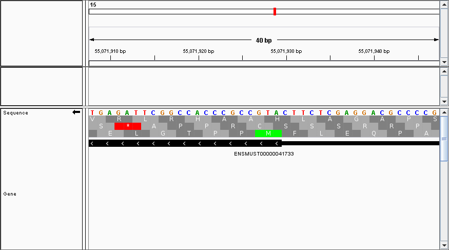
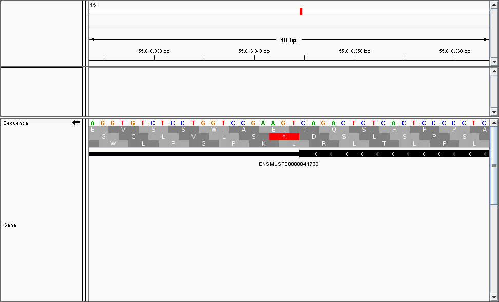

# Creating reference indices

The [usage instructions](usage-instructions.md) give the necessary commands to
create the reference indicies required for Rp-Bp. This document describes how to
download or otherwise find the necessary files and sequences.

## Reference genome sequence

While the most recent version available of the reference genome sequence should
be used, we do not recommend to include things like haplotypes in the reference
for Rp-Bp. First, Rp-Bp does not treat these differently than "normal"
chromosomes. Second, the inclusion of these can greatly increase the alignment
step (with STAR). Most importantly, though, if these extra sequences
substantially overlap the main reference, reads which align to both will be
called as multimappers and discarded.

As mentioned in the [usage instructions](usage-instructions.md), the "primary
assembly" file from Ensembl contains the appropriate sequences and identifiers.
The "top level" Ensembl genome assembly includes haplotype information. Please
see [Ensembl](http://www.ensembl.org/info/genome/genebuild/assembly.html) for
more information about the differences between assemblies.

## Reference annotations

Again, we recommend using the most recent version of annotations available. The
annotations **must match** the version of the reference genome sequence. As
described in the [usage instructions](usage-instructions.md), at least the
`exon` features must be present, and the transcript identifiers (`transcript_id`
attribute) must match for exons from the same transcript. The `CDS` features
must also be present in the annotation file. Rp-Bp's ORF labeling algorithm
assumes that annotated CDSs *include* the start codon but *exclude* the stop
codon. This can be verified by loading the annotations and sequence into a
genome viewer such as IGV. Zooming in around the start of a CDS (the "thick"
part) should show that the start codon begins exactly where the CDS annotations
begins. For example:

Likewise, the stop codon *should not* be included in the "thick" part.

The Ensemble annotations follow these conventions, but others may not. If there
is a problem with the annotations, it is likely to manifest as many `within` and
`suspect` ORFs while very few `canonical` ORFs predicted as translated.

Following standard conventions, the genomic locations are taken to be base-1 and
inclusive. Other feature types, such as `gene`, `start_codon` and `stop_codon`
may be present in the file, but they **are not used** for extracting ORFs.

**N.B.** In case CDS annotations are *not* available, Rp-Bp can still be run as
normal. The only difference is that the ORF labels will not be meaningful.

## "ribosomal" index

The ribosomal filtering step is not as imperative for Rp-Bp as for some other
types of analysis (such as anything based on RPKM); this is because reads which
align to these types of sequences tend to be multimappers and are discarded
anyway. Nevertheless, filtering as many of these as possible ensures the rest
of the pipeline runs more efficiently.

Further, the ribosomal subunits, and other similar sequences, are often not
included in genome annotations. Thus, it is possible that reads which map to the
ribosomal subunit end up mapping uniquely to the genome. Thus, we recommend a
comprehensive ribosomal index for filtering.

We typically include the following in our indices:

* The large and small ribosomal subunit sequences, typically from NCBI. These 
  can be surprisingly difficult to track down; nevertheless, a search using the
  terms: `"ribosomal subunit"` and `<organism>` (including the quotes around
  `ribosomal subunit`) typically works. ([example](https://www.ncbi.nlm.nih.gov/nuccore/?term=%22ribosomal+subunit%22+mouse))

* The genomic tRNA sequences from [GtRNAdb](http://gtrnadb.ucsc.edu/). Since
  only the sequences are used, it is not very important if the annotation
  version in GtRNAdb does not match that used in the rest of the analysis. For
  example, using the tRNAs from GRCh37 and annotations from GRCh38 should not
  cause problems. Of course, if matching versions are available, it is preferred
  to use them.

* "Mt_rRNA", "Mt_tRNA" and "rRNA" genes from BioMart. In particular, we select
  those options for the "Gene type" filter. For "Attributes", we select 
  "Sequences", and then specifically "Exon sequences". Additionally, including
  the "Gene type" in the header can be helpful later for identifying where reads
  in the `with-rrna` folder mapped.

Obviously, depending on the goal of the analysis, the choice of indicies could
vary. For example, it may be desirable to include tRNA in the analysis or to
exclude known non-coding RNA species, such as snRNAs. These could also be
included in the "Gene type"s from BioMart.

## *de novo* assembly

Often, matching RNA-seq is available for riboseq datasets. In these cases, we
highly recommend creating a *de novo* assembly from the RNA-seq data. A variety
of algorithms are available for this task. Internally, we use a custom pipeline
which is based on the STAR aligner and StringTie assembler. Many, many other
options exist for transcript assembly, though. The only requirement for use with
Rp-Bp is that the assembler produces a valid GTF file (or something which can
be converted into GTF). The coordinates in the GTF file must match those in the
reference genome.

*de novo* assembly algorithms do not typically identify coding regions (that is
what riboseq is for!); however, if they do include CDS annotations, those should
match the same start and stop codon conventions described above.
