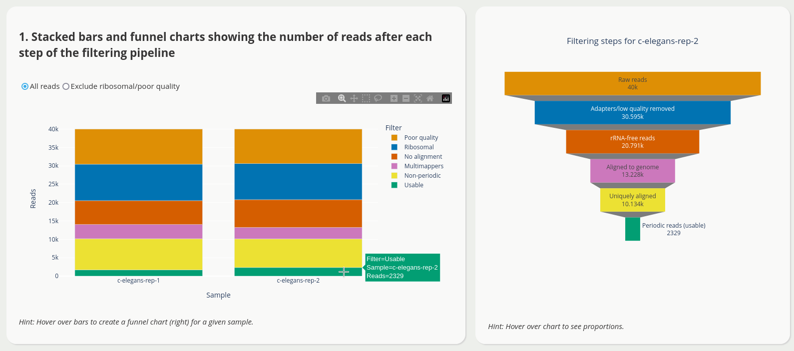
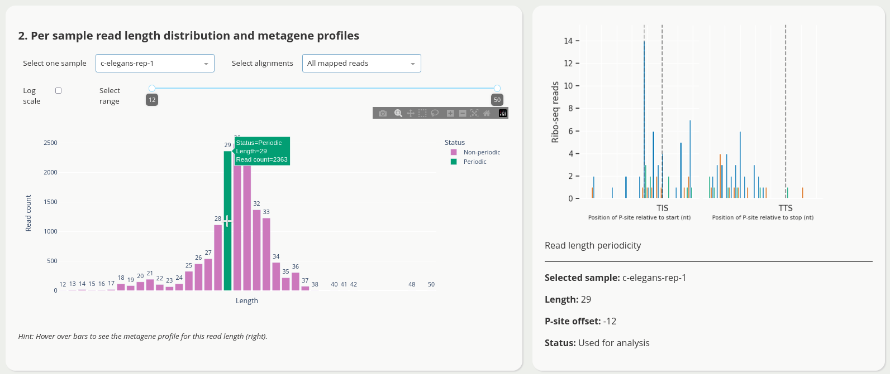
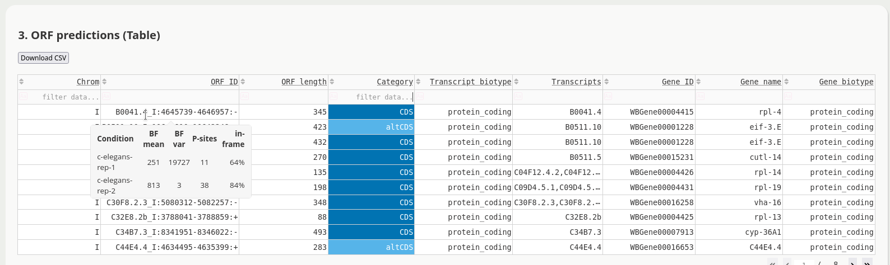
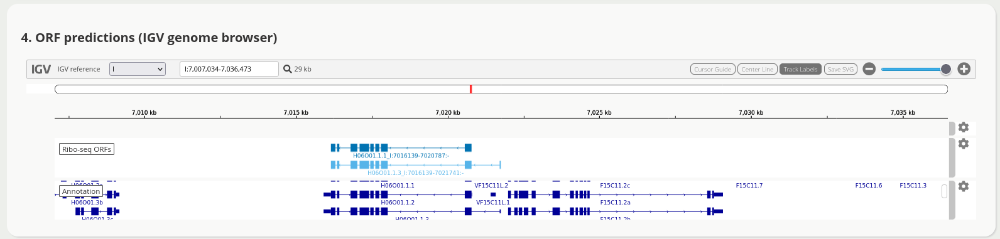

.. _apps:

Visualization and QC
====================

Use the *interactive dashboards* to facilitate quality control (QC) and Ribo-seq ORFs discovery, just follow the "hints".

.. important::

    To prepare the input for the dashboards, follow the instructions below. To use the quality control app, intermediate
    files are required, *i.e.* the pipeline must have been run with the ``-k/--keep-intermediate-files`` flag.

How to prepare the input for the dashboards
-------------------------------------------

Summarizing the profile construction
^^^^^^^^^^^^^^^^^^^^^^^^^^^^^^^^^^^^

To prepare the input for the *profile construction dashboard*

.. code-block:: bash

    summarize-rpbp-profile-construction [options] config

For all options, consult the API for :ref:`api_profile`.

Required input
""""""""""""""

Output files from the :ref:`run_profile` step.

Expected output
"""""""""""""""

The base path for these files is: *<riboseq_data>/analysis/profile_construction*.

* *<project_name>[.note].read-filtering-counts.csv.gz* A CSV file with read counts after each step of the pipeline, one row per sample, with the following columns: "note" (sample name), "raw_data_count" (reads in the original FASTQ), "without_adapters_count" (reads remaining after running Flexbar), "without_rrna_count" (reads remaining after rRNA removal), "genome_count" (genome alignments), "unique_count" (unique genome alignments), "length_count" (periodic reads).

* *<project_name>[.note].length-distribution.csv.gz* A CSV file with counts of aligned reads for each length, one row per sample.

* *<project_name>[.note][-unique].periodic-offsets.csv.gz* A CSV file with all P-site offsets and read lengths for each samples.

* *<project_name>[.note][-unique].frame-counts.csv.gz* A CSV file with P-site adjusted coverage across 3 frames summed across all ORFs for each sample.

Summarizing the **Rp-Bp** predictions
^^^^^^^^^^^^^^^^^^^^^^^^^^^^^^^^^^^^^

To prepare the input for the *predictions dashboard*

.. code-block:: bash

    summarize-rpbp-predictions [options] config

For all options, consult the API for :ref:`api_predictions`.

Required input
""""""""""""""

Output files from the :ref:`run_predictions` step.

Expected output
"""""""""""""""

The base path for these files is: *<riboseq_data>/analysis/rpbp_predictions*.

* *<project_name>[.note][-unique][.filtered].predicted-orfs.bed.gz* A BED12+ file with the combined predicted translation events (Ribo-seq ORFs) from all samples and replicates. Additional columns include sample or replicate, Bayes factor mean and variance, P-site coverage across 3 frames, ORF number, ORF length, label, host transcript biotype, and associated gene id, name and biotype, and compatible transcripts.

* *<project_name>[.note][-unique][.filtered].igv-orfs.bed.gz* A BED12 file with all unique Ribo-seq ORFs.

* *<project_name>.summarize_options.json* A json summary file for the app.

* *<genome_name>.circos_graph_data.json* A json file with the ORF distribution across chromosomes for the app.

.. hint::

    The file *<project_name>[.note][-unique][.filtered].predicted-orfs.bed.gz* has a final output combining all predictions across your samples and/or replicates (including Bayes factor mean and variance for each sample, *etc.*). If you need a unique list of Ribo-seq ORFs (only coordinates *i.e* standard BED12, without duplicated entries for samples and/or replicates), use *<project_name>[.note][-unique][.filtered].igv-orfs.bed.gz*.

.. _apps_launch:

How to launch the web applications
----------------------------------

.. attention::

    For the apps, the configuration file is passed via a (required) named argument using `-c/--config`.

.. tip::

    Any of the above command will open a browser page with the web application running locally. You can also specify a ``--host`` and a ``--port``, *e.g.* if launching the app from a remote server use ``--host 0.0.0.0``, then open a page on *http://X.X.X.X:8050* where *X.X.X.X* is the public IP of your remote server.

Ribo-seq quality control
^^^^^^^^^^^^^^^^^^^^^^^^

To launch the *profile construction dashboard*

.. code-block:: bash

    rpbp-profile-construction-dashboard [options] -c CONFIG

The application has multiple views to facilitate quality control, *e.g.*

For all options, consult the API for :ref:`api_app1`.

Ribo-seq ORFs discovery
^^^^^^^^^^^^^^^^^^^^^^^

To launch the *predictions dashboard*

.. code-block:: bash

    rpbp-predictions-dashboard [options] -c CONFIG

The application has multiple views to facilitate ORF discovery, including an integrated `IGV browser <https://software.broadinstitute.org/software/igv/>`_ for the visual exploration of predicted Ribo-seq ORFs, *e.g.*

Try it out, and see more!
For all options, consult the API for :ref:`api_app2`.
