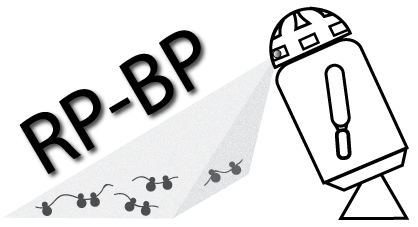

.. Rp-Bp documentation master file, created by
   sphinx-quickstart on Sat Jan 21 14:03:14 2023.
   You can adapt this file completely to your liking, but it should at least
   contain the root `toctree` directive.

Rp-Bp: Ribosome profiling with Bayesian predictions
===================================================

Introduction
------------

Ribosome profiling (Ribo-seq) is an RNA-sequencing-based readout of RNA translation. Isolation and deep-sequencing of ribosome-protected RNA fragments (ribosome footprints) provides a genome-wide snapshot of the translatome at sub-codon resolution. Ribo-seq has enabled to uncover thousands of open reading frames (ORFs) within noncoding RNAs and presumed untranslated regions (UTRs) of protein-coding genes. Ribo-seq ORFs can encode missing conserved proteins, taxonomically restricted, or disease-specific proteins, they can be involved in regulation of RNA and/or protein abundance, or can be the result of random translation, among a wide range of *functional* scenarios.

Conceptually, actively translated ORFs are predicted based on ribosome density. In general, however, ribosome occupancy itself, as indicated by the fragment reads mapped onto the transcriptome, is not sufficient *e.g.* due to technical ( ligation bias or other protocol-dependent artifacts, amplification by PCR, *etc.* ) and biological noise ( regulatory RNAs that bind with the ribosome, ribosome engagement without translation, *etc.* ). But the technique allows to recover the precise location of the peptidyl-site (P-site) of the ribosome within each fragment or read, owing to its single-nucleotide resolution. Aligned by their P-site positions, the reads from actively translating ribosomes should exhibit a 3-nt periodicity along the ORF (the ribosome moves by steps of a codon, *i.e.* 3-nt). To select reads and predict translation, most methods, including **Rp-Bp**, take advantage of this 3-nt periodicity.

**Rp-Bp** is an unsupervised Bayesian approach to predict translated open reading frames (ORFs) from ribosome profiles, using the automatic Bayesian Periodic fragment length and ribosome P-site offset Selection (BPPS), *i.e.* read lengths and ribosome P-site offsets are inferred from the data, without supervision. **Rp-Bp** is able to handle *de novo* translatome annotation by directly assessing the periodicity of the Ribo-seq signal.

**Rp-Bp** can be used for ORF discovery, or simply to estimate periodicity in a set of Ribo-seq replicates, *e.g.* to know which samples and read lengths are usable for downstream analyses. When used for ORF discovery, **Rp-Bp** automatically classifies ORFs into different biotypes or categories, relative to their host transcript.

.. toctree::
   :titlesonly:

   getting-started
   installation
   user-guide
   apps
   rpbp-genome
   existing-alignments
   tutorial
   api
