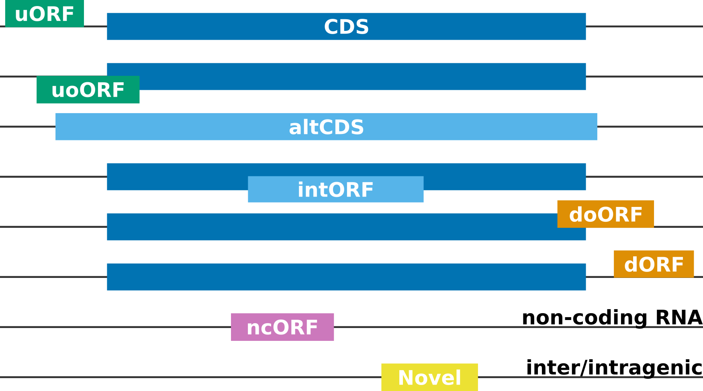

More about ``prepare-rpbp-genome``
==================================

As part of the index creation step, **Rp-Bp** extract all putative ORFs and assign to each one a label based on its position relative to the annotated transcript-exon structure. Labels can be useful to quickly identify certain ORF types that may be of particular interest, *e.g.* upstream ORFs, or ORFs from non-coding RNAs.

.. note::

    The ORF "id" is of the form *transcript_seqname:start-end:strand*. *seqname* is the chromosome or contig. The start codon is included, but the stop codon is not. The host *transcript* "id" should not contain underscores!

.. hint::

    In some cases, the ORF label may not be consistent with the host transcript, as reported by the ORF "id". To resolve such seemingly incoherent assignments, compatible transcripts are reported for each ORF in *<genome_name>.orfs-labels.annotated[.orf_note].tab.gz* and shown in the prediction dashboard (see `Visualization and quality control <apps.html>`_).

Categories of Ribo-seq ORFs
---------------------------

* **CDS**: Canonical (annotated) coding sequence
* **altCDS**: Alternative CDS (*e.g.* N/C-terminus extension/truncation, alternatively spliced variants, *etc.*)
* **intORF**: Translation event within a CDS (in- or out-of-frame)
* **uORF/uoORF**: Translation event in the 5' untranslated region (UTR) of or partially overlapping an annotated protein-coding gene
* **dORF/doORF**: Translation event in the 3' untranslated region (UTR) of or partially overlapping an annotated protein-coding gene
* **ncORF**: Translation event in an RNA annotated as non-coding (lncRNA, pseudogene, *etc.*)
* **Novel**: Translation event inter- or intragenic (only when **Rp-Bp** is run with a *de novo* assembly, see below)

Labels such as **overlap** or **suspect** arise when **Rp-Bp** is not able to resolve the position of an ORF without ambiguity. In practice, for standard annotations, we do not see these categories.

More about *de novo* ORF discovery
----------------------------------

For **Rp-Bp**, there is no difference between annotated and *de novo* assembled transcripts. In both cases, ORFs are extracted from the transcripts based on the given start and stop codons. However, it is often of scientific interest to identify *Novel* Ribo-seq ORFs. These are the most interesting, as they do not overlap the annotations at all, but **Rp-Bp** also identifies **Novel altCDS** and **Novel ncORF**.

Hence, when matching RNA-seq is available (same reference genome), we highly recommend to create a *de novo* assembly. The only requirement is that the assembler produces a valid GTF file (or a format that can be converted to GTF). In a *de novo* assembly, coding regions are typically not identified (that is what Ribo-seq is for!). However, if your assembly also includes CDS annotations, they must satisfy the start/stop codon GTF2 specifications (stop codon not included in the CDS.)
