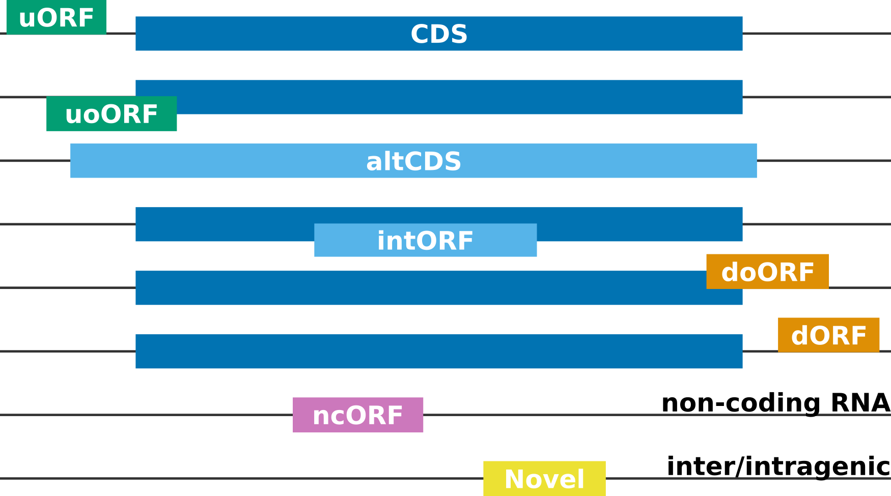

.. _rpbp_genome:

More about annotations
======================

When running ``prepare-rpbp-genome``, **Rp-Bp** extracts all putative Ribo-seq ORFs and assigns to each one a label based on its position relative to the annotated transcript-exon structure. Labels can be useful to quickly identify certain ORF types that may be of particular interest, *e.g.* upstream ORFs, or ORFs from non-coding RNAs.

.. note::

    The ORF "id" is of the form *transcript_seqname:start-end:strand*. *seqname* is the chromosome or contig. The start codon is included, but the stop codon is not. The host *transcript* "id" should not contain underscores!

.. hint::

    In some cases, the ORF label may not be consistent with the host transcript, as reported by the ORF "id". To resolve such seemingly incoherent assignments, compatible transcripts are reported for each ORF in *<genome_name>.orfs-labels.annotated[.orf_note].tab.gz* and shown in the prediction dashboard (see :ref:`apps`).

Categories of Ribo-seq ORFs
---------------------------

* **CDS**: Canonical (annotated) coding sequence
* **altCDS**: Alternative CDS (*e.g.* N/C-terminus extension/truncation, alternatively spliced variants, *etc.*)
* **intORF**: Translation event within a CDS (in- or out-of-frame)
* **uORF/uoORF**: Translation event in the 5' untranslated region (UTR) of or partially overlapping an annotated protein-coding gene
* **dORF/doORF**: Translation event in the 3' untranslated region (UTR) of or partially overlapping an annotated protein-coding gene
* **ncORF**: Translation event in an RNA annotated as non-coding (lncRNA, pseudogene, *etc.*)
* **Novel**: Translation event inter- or intragenic (only when **Rp-Bp** is run with a *de novo* assembly, see below)

Labels such as *overlap* or *suspect* arise when **Rp-Bp** is not able to resolve the position of an ORF without ambiguity. In practice, we do not see these categories for standard organisms.

.. _denovo:

More about *de novo* ORF discovery
----------------------------------

It is often of interest to identify *Novel* Ribo-seq ORFs, *i.e.* not only un-annotated ORFs, but ORFs that do not overlap the annotation at all. For **Rp-Bp**, there is no difference between annotated and *de novo* assembled transcripts. In both cases, ORFs are extracted from the transcripts based on the given start and stop codons. Hence, when matching RNA-seq is available, we highly recommend to create a *de novo* assembly. The only requirement is that the assembler produces a valid GTF file (or a format that can be converted to GTF).

.. caution::

   In a *de novo* assembly, coding regions are typically not identified (that is what Ribo-seq is for!). However, if your assembly also includes
   CDS annotations, they must satisfy the start/stop codon GFF2 specifications (stop codon not included in the CDS.)

.. hint::

   ``prepare-rpbp-genome`` may fail unexpectedly with ``ERROR: Duplicate ORF ids were found``. Duplicate ORF ids can arise due to different ORFs having the same start/end coordinates and the same host transcript, or when a *de novo* assembled transcript has a complete, exact match of the intron chain with an existing, annotated transcript. This usually only affects a handful of transcripts. To handle this situation, you can identify duplicate ORF ids in *<genome_name>.orfs-genomic[.orf_note].annotated.bed.gz* and *<genome_name>.orfs-genomic[.orf_note].de-novo.bed.gz*, collect the associated host transcript ids into a file, remove them from the newly created *de novo* GTF *.e.g* with ``grep -v -f duplicated_transcripts.txt path/to/de-novo.gtf > path/to/de-novo.slim.gtf``, update ``de_novo_gtf`` in the configuration file, and re-run ``prepare-rpbp-genome``.

.. tip::

   When matching RNA-seq is available, you can also perform translational efficiency analysis (TEA), see
   `Ribotools <https://ribotools.readthedocs.io/en/latest/index.html>`_ for more information.
